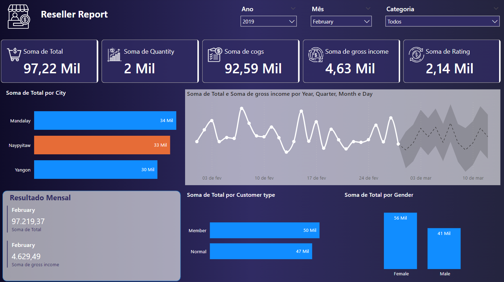

# Aceleração Internacional para Profissionais de Tecnologia: Turning Data into gold using Power BI
 

## Sobre o Projeto
Neste projeto você irá replicar as páginas criadas durante o curso [Power Bi Aceleração](https://web.dio.me/acceleration/aceleracao-internacional-para-profissionais-de-tecnologia-turning-data-gold-using-power-bi) com exemplo disponibilizado. Acesse o link do Github para ter acesso aos dados: [Juliana Zanelatto](https://github.com/julianazanelatto/power_bi_aceleracao) 

## Dashboard: Reseller Report
> Registro histórico de dados de vendas em 3 supermercados diferentes
- Dataset: [Kaggle Supermarket Sales](https://www.kaggle.com/datasets/aungpyaeap/supermarket-sales)

- **Arquivo:** `reseller_evaluation.pbix`

- [**Dashboard - online**](https://app.powerbi.com/view?r=eyJrIjoiYWMyNThlZDMtODU2OC00M2U5LWIwMzgtZTZhM2RhMzQ5MTQ1IiwidCI6IjlmZjQ5YWNkLTJmNTMtNGJmMS04OTkwLTRjYzY0ZGM4YjljMiJ9)

 

## Como Contribuir

Se você ama dados tanto quanto nós, sua contribuição é bem-vinda! Faça fork, adicione seus próprios insights ou sugira melhorias. Juntos, podemos tornar este projeto ainda mais incrível! 🤝💬

 

## Como Iniciar

1. Clone o repositório
2. Abra o arquivo principal no Power BI
3. Explore, descubra e divirta-se!
